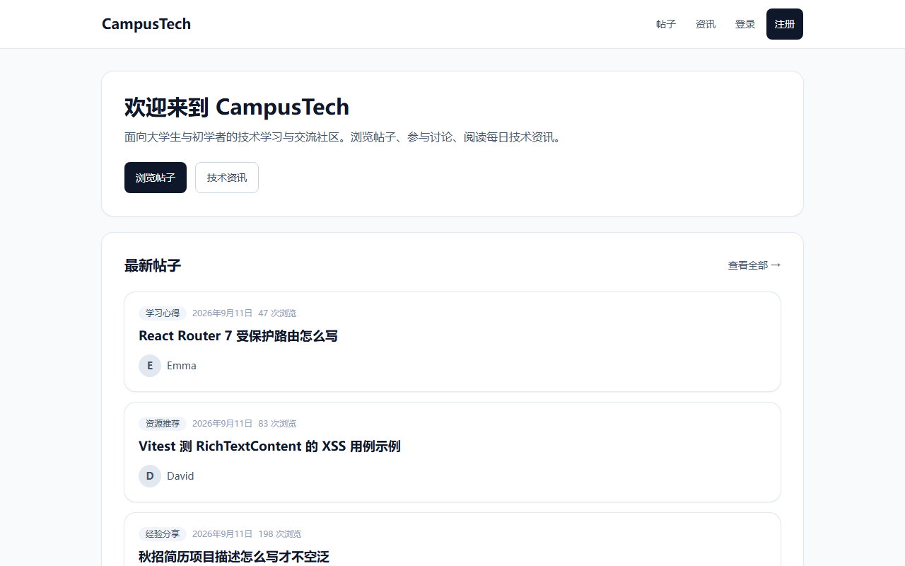
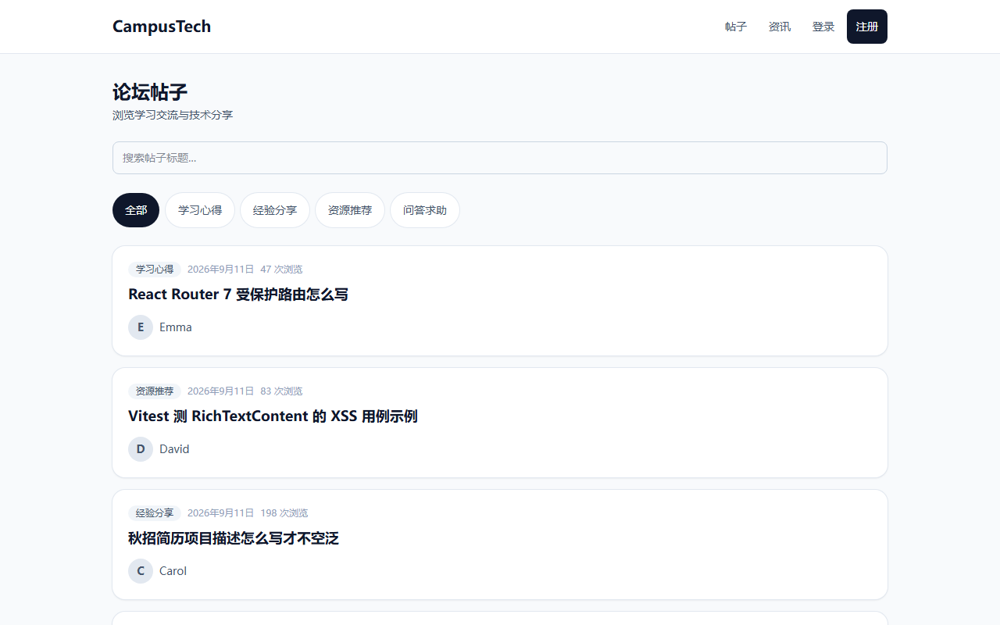
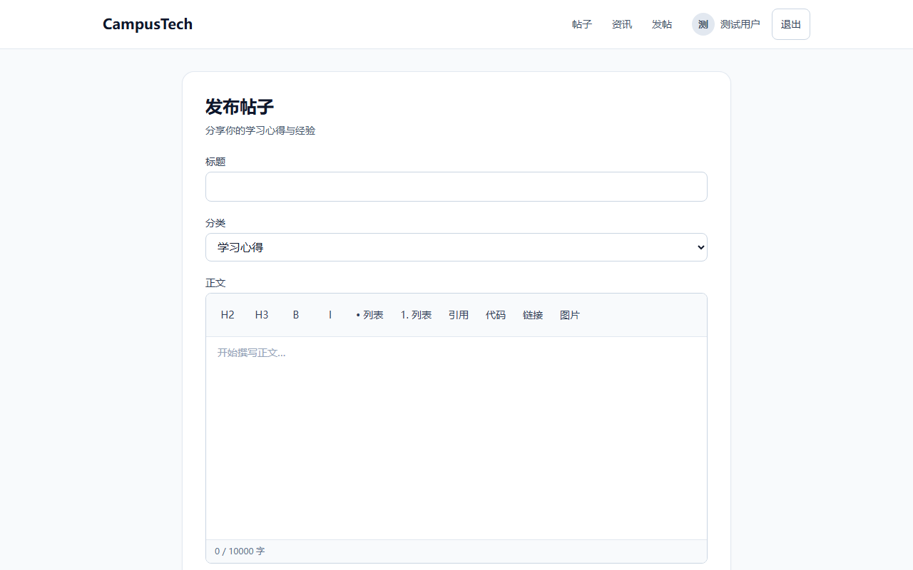
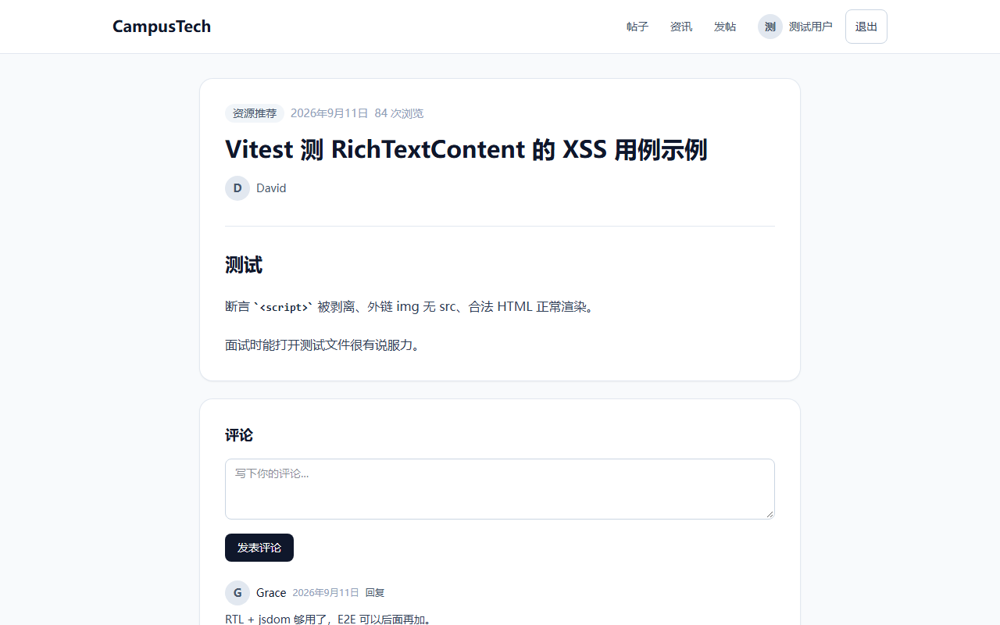

# CampusTech

**React 技术社区 SPA** — 面向大学生与初学者的学习交流、富文本发帖、评论互动与 RSS 资讯聚合平台。

## 前端技术栈

React 19 · TypeScript · Vite · React Router · TanStack Query · Tailwind CSS · TipTap · Axios · Vitest

> 后端：NestJS + PostgreSQL + Prisma（REST API 联调，端口 3000）

## 功能截图

| 首页 | 帖子列表 |
| --- | --- |
|  |  |

| 发帖编辑器（TipTap） | 帖子详情 + 评论 |
| --- | --- |
|  |  |

| 个人中心（375px 移动端） |
| --- |
|  |

## 快速开始

### 1. 前端（推荐先跑）

```bash
cd frontend
npm install
npm run dev
```

浏览器打开 http://localhost:5173

开发模式下 `/api` 与 `/uploads` 由 Vite 代理到 `http://localhost:3000`，无需额外配置。

### 2. 后端（精简）

```bash
cd backend
cp .env.example .env   # Windows: Copy-Item .env.example .env
npm install
npx prisma migrate dev
npm run start:dev
```

API：http://localhost:3000/api

### 3. 数据库

PostgreSQL 15+，在 `backend/.env` 中配置 `DATABASE_URL`。也可使用根目录 `scripts/setup-db.bat` 初始化。

## 前端模块说明

- **路由**：公开页（首页 / 帖子 / 资讯）+ `ProtectedRoute` 守卫（发帖 / 编辑 / 个人中心）+ `GuestRoute`（已登录不可进登录页）+ 404 兜底；重页面 `React.lazy` 按需加载。
- **状态**：服务端数据用 TanStack Query（如 `['posts', page, category, keyword]`）；表单与 Tab 等 UI 态用 `useState` / URL 参数。
- **组件分层**：`pages/` 页面 · `components/` 复用 UI · `hooks/` 认证与 debounce · `api/` Axios 封装 · `types/` 共享类型。
- **体验**：统一 `LoadingSpinner` / `EmptyState` / `ErrorMessage`；列表 debounce 搜索；TipTap 编辑器动态 import，首屏 bundle 约 **286 KB**（优化前 ~803 KB）。

## 测试

```bash
cd frontend
npm run test        # 监听模式
npm run test:run    # 单次运行
```

覆盖登录页交互、富文本 XSS 过滤（`RichTextContent`）、个人中心「我的帖子」列表态。

## 部署

> Demo 链接：待子任务 F 部署后补充。

生产构建时复制 `frontend/.env.example` 为 `.env`，设置 `VITE_API_BASE_URL` 指向线上 API。

## 深度文档

- [前端架构说明](./docs/前端架构说明.md) — 路由、Query 缓存、性能优化与 bundle 对比

## 环境变量

| 位置 | 变量 | 说明 |
| --- | --- | --- |
| `frontend/.env` | `VITE_API_BASE_URL` | 生产 API 地址；开发可留空用 proxy |
| `backend/.env` | `DATABASE_URL` | PostgreSQL 连接串 |
| `backend/.env` | `JWT_SECRET` | JWT 签名密钥 |
| `backend/.env` | `PORT` | 默认 3000 |
